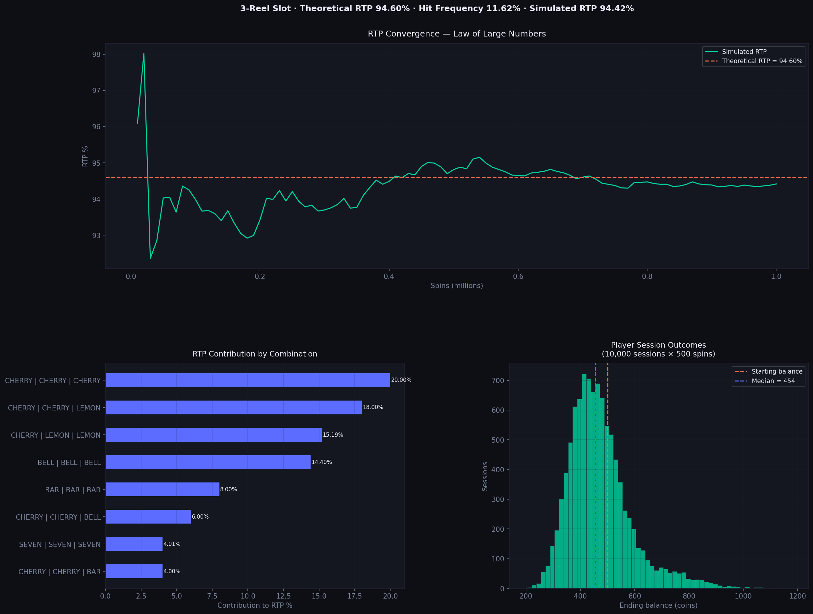
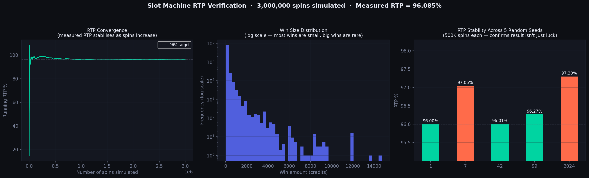

# 🎰 Slot Machine RTP Analysis

Mathematical modelling and Monte Carlo simulation of a 3-reel slot machine to compute the exact Return to Player (RTP) and evaluate key game performance metrics including house edge, hit frequency, and volatility.

<p align="center">
  
</p>

---

## Project Snapshot

| Category | Details |
|----------|---------|
| **Domain** | Game Mathematics |
| **Language** | Python |
| **Approach** | Analytical Enumeration + Monte Carlo Simulation |
| **Game Type** | 3-Reel Slot Machine |
| **Simulation Size** | 1,000,000 Spins |

---

## Features

- Exact RTP calculation using exhaustive outcome enumeration
- Monte Carlo simulation for empirical validation
- RTP convergence analysis
- House edge estimation
- Hit frequency and volatility analysis
- Automated statistical reports and visualizations

---

## Results

| Metric | Value |
|---------|-------:|
| **Theoretical RTP** | **94.60%** |
| **Simulated RTP** | **94.42%** |
| **Difference** | **0.18%** |
| **House Edge** | **5.40%** |
| **Hit Frequency** | **11.63%** |
| **Volatility (Std. Dev.)** | **5.46** |
| **Profitable Sessions** | **31.9%** |

<p align="center">
  
</p>

The simulation closely matches the analytical RTP, validating the mathematical model through large-scale random sampling.

---

## Repository Structure

```text
slot-machine-rtp-analysis/
│
├── src/
│   ├── analytical_rtp.py
│   ├── config.py
│   ├── engine.py
│   ├── simulate.py
│   └── slot_math.py
│
├── outputs/
│   ├── slot_analysis.png
│   ├── rtp_simulation.png
│   ├── paytable_analysis.csv
│   ├── rtp_convergence.csv
│   ├── rtp_seed_stability.csv
│   ├── rtp_summary.csv
│   └── summary.csv
│
├── requirements.txt
├── .gitignore
└── README.md
```

---

## Installation

```bash
git clone https://github.com/ShyamMath/slot-machine-rtp-analysis.git
cd slot-machine-rtp-analysis
pip install -r requirements.txt
```

---

## Run

```bash
python src/slot_math.py
```

All plots and statistical reports are automatically generated in the `outputs/` directory.

---

## Tech Stack

- Python
- NumPy
- pandas
- Matplotlib

---

## Future Enhancements

- Multi-payline evaluation
- Wild and Scatter symbols
- Bonus game mechanics
- Progressive jackpot modelling
- Configurable reel strips and paytables

---

## Author

**Shyam Veer Yadav**s · matplotlib · itertools
